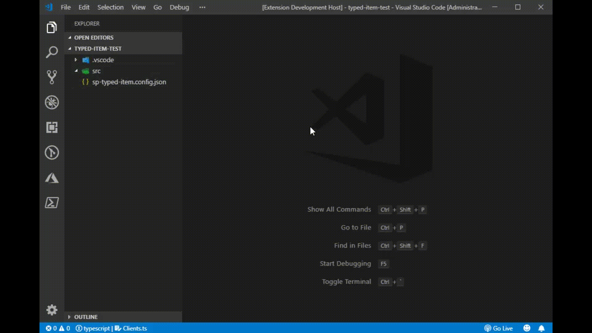

# SharePoint Typed Item

Node.js module, CLI and VSCode add-in for generating strongly typed interfaces based on SharePoint data.

## How it works

1. You should provide configuration file, which describes your target site url, lists and content types you want to generate interfaces for. 
2. Run the generation process.
3. Consume generated interfaces in your project, which deals with SharePoint REST API and list data.

Checkout how it works in action using VSCode extension:   

 

## How to use: 
### VSCode 

Checkout VSCode extension [home page](to be added)

### CLI  
1. Run `$ npm install sp-typed-item -g`
2. Generate a file with your authentication details. `sp-typed-item` CLI understands format, used by [node-sp-auth-config](https://github.com/koltyakov/node-sp-auth-config) module and supports the same set of authentication options. Generate authentication file with `node-sp-auth-config` CLI: `$ sp-auth init --path auth.private.json`.  Refer to `node-sp-auth-config` home page for usage details. 
3. Create configuration file `sp-typed-item.json`. Read about configuration file format [further](format). 
4. Run `$ sp-item render --config path-to-sp-typed-item-config.json`

### Node.js
1. Run `$ npm install sp-typed-item --save[-dev]`
2. ```typescript
   import { SPTypedItem, Config } from 'sp-typed-item';

   let config: Config[] = require(path.resolve('path-to-sp-typed-item-config.json'));

   await SPTypedItem.renderFiles(config[0]);
   ```

## Configuration file
`sp-typed-item` configuration file holds essential information about environment and interface generation settings. 

### Example file with all possible settings: 
```json
[
  {
    "siteUrl":"https://contoso.sharepoint.com/sites/dev",
    "authConfigPath":"./config/auth.json",
    "outputPath":"./Generated",
    "lists":[
      {
        "url":"Lists/Clients",
        "fileName":"IClientItems",
        "fields":{
          "exclude":[
            "Title",
            "FieldInternalName"
          ],
          "excludeHidden":true
        }
      }
    ],
    "contentTypes":[
      {
        "id":"0x01005207A2B9B939CE43AB38D848E245926B",
        "fileName":"IArchiveItems",
        "fields":{
          "exclude":[
            "Title",
            "FieldInternalName"
          ],
          "excludeHidden":true
        }
      }
    ]
  }
]
```
#### Root element
Array of configuration items. 
#### Configuration item  
`siteUrl` - required, full url to your target SharePoint site  

`authConfigPath` - path to your json authentication details file. It's not required for VSCode extension, because VSCode extension handles it for you  

`outputPath` - required, path to a folder, where all interfaces will be generated  

`lists` - this node describes all lists, which should be included in generation process. Either `lists` or `contentTypes` node should be provided. Array of configuration items:

* `url` - required, list url relative to a web, i.e. `Lists/MyList`, **not** `sites/mysite/Lists/MyList` 
* `filename` - you can provide custom file name (and interface name) for your list. Each list entry corresponds to one output interface file
* `fields` - optional, you can filter out some unnecessary fields:
  * `excludeHidden` - optional, specify to filter out all hidden fields
  * `exclude` - optional array, the list of fields to be excluded by internal name  
  
`contentTypes` - describes all content types to be included in generation process. Either `lists` or `contentTypes` node should be provided. Array of configuration items:
 * `id` - required, content type id
 * the rest of parameters are the same as for list, i.e. `fileName`, `fields`. 

Minimal working configuration file: 
```json
[
  {
    "siteUrl":"https://contoso.sharepoint.com/sites/dev",
    "authConfigPath":"./config/auth.json",
    "outputPath":"./Generated",
    "lists":[
      {
        "url":"Lists/Clients"
      }
    ]
  }
]
```  

**NOTE:** for VSCode extension `authConfigPath` is not required. 